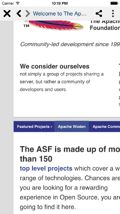
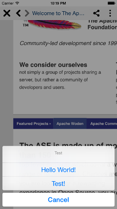
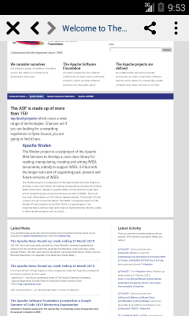

<!---
    Licensed to the Apache Software Foundation (ASF) under one
    or more contributor license agreements.  See the NOTICE file
    distributed with this work for additional information
    regarding copyright ownership.  The ASF licenses this file
    to you under the Apache License, Version 2.0 (the
    "License"); you may not use this file except in compliance
    with the License.  You may obtain a copy of the License at

      http://www.apache.org/licenses/LICENSE-2.0

    Unless required by applicable law or agreed to in writing,
    software distributed under the License is distributed on an
    "AS IS" BASIS, WITHOUT WARRANTIES OR CONDITIONS OF ANY
    KIND, either express or implied.  See the License for the
    specific language governing permissions and limitations
    under the License.
-->

com.initialxy.cordova.themeablebrowser
======================================

This plugin is a fork of [org.apache.cordova.inappbrowser](https://github.com/apache/cordova-plugin-inappbrowser). It attempts to retain most of the features of the InAppBrowser. In fact, for the full list of features inherited from InAppBrowser, please refer to [InAppBrowser's documentation](https://github.com/apache/cordova-plugin-inappbrowser/blob/master/README.md).

The purpose of this plugin is to provide an in-app-browser that can also be configured to match the theme of your app, in order to give it a more immersive look and feel for your app, as well as provide a more consistent look and feel across platforms.

This plugin launches an in-app web view on top the existing [CordovaWebView](https://github.com/apache/cordova-android/blob/master/framework/src/org/apache/cordova/CordovaWebView.java) by calling `cordova.ThemeableBrowser.open()`.

    // Uses stub button image that's in fact, default. Just for example.
    var ref = cordova.ThemeableBrowser.open('http://apache.org', '_blank', {
        backButtonCanClose: true,
        hideForwardButton: true,
        toolbarColor: '#e1e1e1ff',
        titleColor: '#000000ff',
        statusbarColor: '#ffffffff',
        navButtonAlign: 'left',
        closeButtonAlign: 'right',
        menuButtonAlign: 'right',
        titleStaticText: 'Hello World!',
        backButtonImage: 'themeablebrowser_stub_back',
        backButtonPressedImage: 'themeablebrowser_stub_back_highlight',
        menuTitle: 'Test',
        menuCancel: 'Cancel',
        menuItems: [
            {
                event: 'hello',
                label: 'Hello World!'
            },
            {
                event: 'test',
                label: 'Test!'
            }
        ]
    });

Installation
------------

    cordova plugin add com.initialxy.cordova.themeablebrowser

Additional Properties
---------------------

In addition to InAppBrowser's properties, following properties were added to fulfill this plugin's purpose.

+ Toolbar and status bar
    + `statusbarColor` sets status bar color for iOS 7+ in RGBA web hex format. eg. `#fff0f0ff`. Applicable only to iOS 7+. iOS only.
    + `toolbarHeight` sets height of toolbar.
    + `toolbarColor` sets browser toolbar color in RGBA web hex format. eg. `#fff0f0ff`. Also see `toolbarImage`.
    + `toolbarImage` sets an image as browser toolbar background in titled mode. This property references to a **native** image resource, therefore it is platform dependent.
    + `toolbarImagePortrait` sets an image for browser toolbar background but only in portrait mode. This property will be overridden by `toolbarImage` if given. This is an iOS only property and references to **native** image resource.
    + `toolbarImageLandscape` sets an image for browser toolbar background but only in landscape mode. This property will be overridden by `toolbarImage` if given. This is an iOS only property and references to **native** image resource.
+ Buttons
    + `backButtonImage` sets image for back button. This property references to a **native** image resource, therefore it is platform dependent.
    + `backButtonPressedImage` sets image for back button in its pressed state. This property references to a **native** image resource, therefore it is platform dependent.
    + `forwardButtonImage` sets image for forward button. This property references to a **native** image resource, therefore it is platform dependent.
    + `forwardButtonPressedImage` sets image for forward button in its pressed state. This property references to a **native** image resource, therefore it is platform dependent.
    + `closeButtonImage` sets image for close button. This property references to a **native** image resource, therefore it is platform dependent.
    + `closeButtonPressedImage` sets image for close button in its pressed state. This property references to a **native** image resource, therefore it is platform dependent.
    + `menuButtonImage` sets image for menu button. Note that menu button is only shown when `menuItems` is given. This property references to a **native** image resource, therefore it is platform dependent.
    + `menuButtonPressedImage` sets image for menu button in its pressed state. Note that menu button is only shown when `menuItems` is given. This property references to a **native** image resource, therefore it is platform dependent.
+ Title
    + `titleColor` sets title text color in RGBA web hex format. eg. `#fff0f0ff`
    + `titleStaticText` sets static text for title. Note that by default title shows the title of the currently shown web page. Also see `hideTitle`.
+ Menu
    + `menuItems` creates a list of menu items for user to choose when menu button is clicked. It must follow the following format `[{event: 'e', label: 'l'}]`. When a menu item is pressed, you will get a custom event specified by the `event` property of the item. Within the received event object, you will also be given the following properties: `url`, which is the current URL in the web view, and `menuIndex`, which is an integer that references to the index of menu item in the given list.
    + `menuTitle` sets menu title when menu button is clicked. iOS only.
    + `menuCancel` sets menu cancel button text. iOS only.
+ Alignment
    + `closeButtonAlign` aligns close button to either `left` or `right`. Default to `left`.
    + `navButtonAlign` aligns back and forward buttons to either `left` or `right`. Default to `left`.
    + `menuButtonAlign` aligns menu button to either `left` or `right`. Default to `right`. Note that menu button is only shown when `menuItems` is given.
+ Visibility
    + `hideTitle` hides title when set to `true`.
    + `hideCloseButton` hides close button when set to `true`.
    + `hideBackButton` hides back button when set to `true`.
    + `hideForwardButton` hides forward when set to `true`.
+ Others
    + `backButtonCanClose` allows back button to close browser when there's no more to go back. Otherwise, back button will be disabled.

One thing to note is that all image resources reference to **native** resource bundle. So all images need to be imported to native project first. In case of Android, the image name will be looked up under `R.drawable`. eg. If image name is `hello_world`, `R.drawable.hello_world` will be referenced.

You may have noticed that one of the major features that ThemedBrowser added is an optional menu, which you can use to prompt user to make a simple choice from a list of items.

FAQ
---

### Why does my menu on Android look ugly?

Android menu is simply a [Spinner](http://developer.android.com/guide/topics/ui/controls/spinner.html), which picks up its style from your Activity's theme. By default Cordova uses the very old [Theme.Black.NoTitleBar](http://developer.android.com/reference/android/R.style.html#Theme_Black_NoTitleBar), which is ugly. Open your AndroidManifest.xml and change your `android:theme` attribute to something more morden, such as [Theme.Holo](http://developer.android.com/reference/android/R.style.html#Theme_Holo) or [Base.Theme.AppCompat](http://developer.android.com/reference/android/support/v7/appcompat/R.style.html#Base_Theme_AppCompat) from [support library](https://developer.android.com/tools/support-library/features.html#v7-appcompat).

### How do I style Android menu?

Android menu is simply a [Spinner](http://developer.android.com/guide/topics/ui/controls/spinner.html) with default layout resources, which picks up its style from your Activity's theme. You can style it by making a theme of your app and apply it to your activity. See `android:dropDownListViewStyle`.

### How do I add margings and paddings?

There is no margins or paddings. However notice that you can assign images to each of the buttons. So take advantage of PNG's transparency to create margins/paddings around your buttons.

### How do I add shadow to the toolbar?

First, notice that you can use an image as well as color for toolbar background. Use PNG for background image and create shadow inside this image. Next, you will probably be concerned about how buttons will slightly misaligned due since they always middle align. Again create some transparent borders in your button images to offset the misalignment. eg. Say your shadow is 5px tall, which causes buttons to allear lower than they shoud. Create a 10px transparent bottom border for each of your button icons and you are set.

Supported Platforms
-------------------

+ iOS 5.0+
+ Android 2.0+

Currently there is no plan to support other platforms, though source code from InAppBrowser is kept for merge purposes, they are inactive, since they are removed from `plugin.xml`.

Migration
---------

This plugin is **not** a drop-in replacement for InAppBrowser. The biggest change that was made from InAppBrowser, which caused it to be no longer compatible with InAppBrowser's API is that `options` parameter now accepts a JavaScript object instead of string.

    var ref = cordova.ThemeableBrowser.open('http://apache.org', '_blank', {
        titleStaticText: 'Hello World!',
        menuItems: [
            {
                event: 'hello',
                label: 'Hello World!'
            }
        ]
    });
    ref.addEventListener('hello', function(event) {
        alert(event.url);
    });

As you can see from above, this allows `menuItems` to have more robust and readable definition.

Furthermore, the object returned by `open` always returns its own instance allowing chaining of methods. Obviously, this breaks the immitation of the `window.open()`, however it's an optional feature that you can choose not to use if you want to stay loyal to the original.

    cordova.ThemeableBrowser.open('http://apache.org', '_blank', {
        titleStaticText: 'Hello World!',
        menuItems: [
            {
                event: 'hello',
                label: 'Hello World!'
            },
            {
                event: 'test',
                label: 'Test!'
            }
        ]
    }).addEventListener('hello', function(event) {
        alert(event.url);
    }).addEventListener('test', function(event) {
        alert(event.url);
    });

Two properties from InAppBrowser are disabled.
+ `location` is always `false` because address bar is not needed for an immersive experience of an integrated browser.
+ `toolbarposition` is always `top` to remain consistent across platforms.

License
-------

This project is licensed under Aapache License 2.0. See [LICENSE](LICENSE) file.
